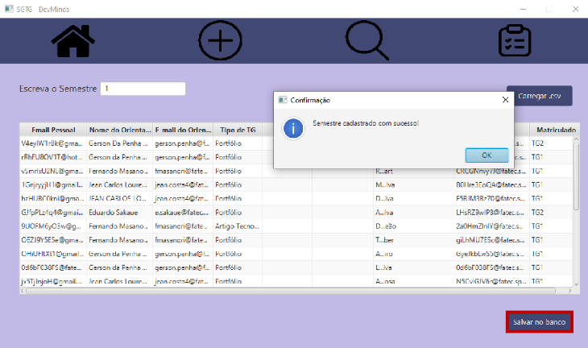
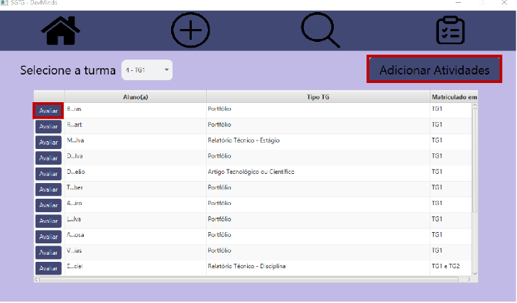
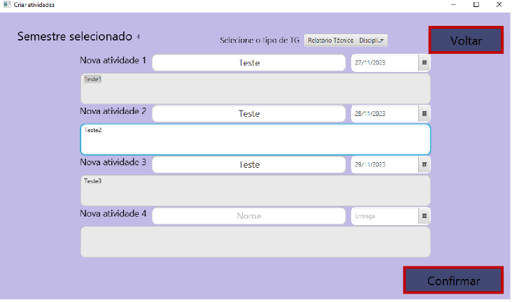
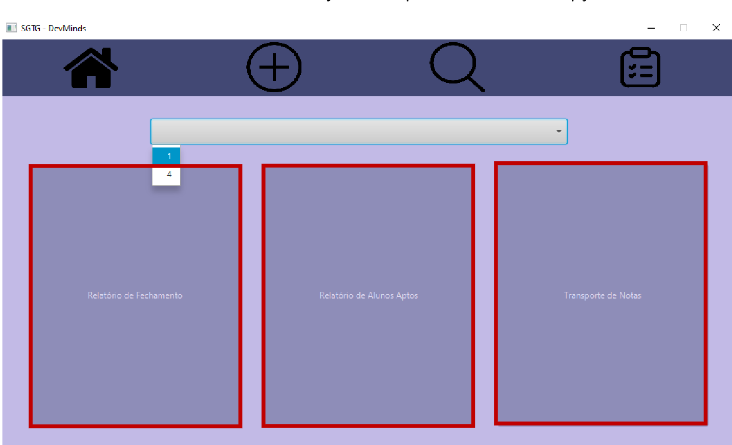
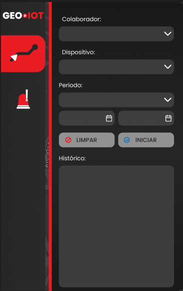
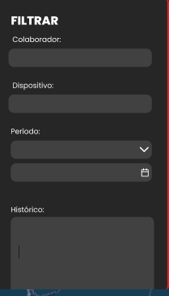
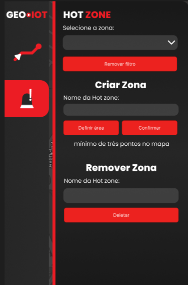
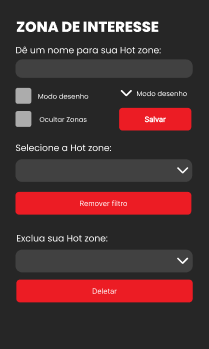
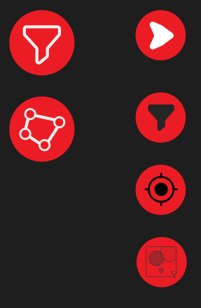

<h1>Gabriel Bartolomeu Guska<h1>

<h2>Introdução<h2>

Tenho 21 anos e atualmente estou me graduando em Banco de dados pela FATEC Prof. Jessen Vidal

<h2>Contatos<h2>

[GITHUB](https://github.com/GabrielBartolomeu1)

[LINKEDIN](https://www.linkedin.com/in/gabriel-guska-5860a1271)

<h2>Conhecimentos<h2>

### Linguagens de Programação:
- Java
- Python
- JavaScript
- TypeScript

### Bancos de Dados:
- MySQL
- PostgreSQL

### Ferramentas:
- Git/GitHub
- Docker

<h2>Projetos<h2>

# 📊 eVal360 - Sistema de Avaliação 360° 

**Projeto acadêmico desenvolvido para PBLTeX (FATEC - 1º Semestre 2023)**  

## Contexto
Solução desenvolvida para automatizar avaliações 360° em instituições de ensino, como projeto integrador da graduação em Banco de Dados. Atuei como desenvolvedor da equipe DevMinds.

## Funcionalidades Principais

### Autenticação e Controle de Acesso
O sistema realiza autenticação comparando os dados de login com um banco de usuários armazenado em arquivo CSV (`usersDB.csv`), com dois níveis de acesso distintos: Administradores têm acesso completo à gestão de turmas e dashboards, enquanto Usuários comuns podem apenas participar das avaliações.

### Gestão Acadêmica
Permite a criação e organização de turmas (cursos) e times (equipes), com validação para garantir que cada usuário participe de apenas uma equipe por turma. Durante a criação de turmas, é possível configurar parâmetros personalizados para Sprints, incluindo quantidade e duração em dias.

### Análise de Dados
Oferece dashboards interativos com visualização gráfica das avaliações, destacando:
- Desempenho individual por fator de avaliação
- Médias por turma com identificação visual de fatores acima/abaixo da média
- Comparativos entre equipes e sprints

### Tecnologias utilizadas

- VS Code
- Python
- Matplotlib
- Github
- Clickup
- Miro
- Csv

### Contribuições pessoais

Métricas

*Dashboard Analítico*

- Desenvolvimento de ferramentas de análise:
    - Adicionei algoritmos para calculo de médias de alunos, turmas
    - Colaborei na melhora de navegação do usuário no sistema

Dashboards

*Visualização de Dados*

- Implementação de:
    - Criação de gráfico de barra, área
    - Criação de dashboards para alunos e admin
    - Indicadores de desempenho por competência

### Hard Skills

Pyhton

### Soft skills

**Trabalho em Equipe**  
Experiência prática em colaboração efetiva em um ambiente de desenvolvimento ágil, aprendendo a balancear contribuições individuais com objetivos coletivos. Desenvolvimento da capacidade de adaptação a diferentes estilos de trabalho e personalidades dentro da equipe.

**Gestão de Tempo e Priorização**  
Domínio crescente na organização de tarefas e cumprimento de prazos em um contexto de desenvolvimento iterativo. Aprimoramento da habilidade de discernir entre urgência e importância nas demandas técnicas.

**Resolução de Problemas**  
Desenvolvimento do pensamento analítico e criativo para enfrentar desafios técnicos, aprendendo a abordar obstáculos de forma estruturada e colaborativa.

**Adaptabilidade**  
Capacidade de responder positivamente a mudanças de requisitos e feedbacks contínuos, mantendo a produtividade em um ambiente dinâmico de desenvolvimento.

**Aprendizado Contínuo**  
Disposição para adquirir novos conhecimentos técnicos e comportamentais, aplicando-os imediatamente no contexto do projeto.

# 📊 SGTG - Sistema de Gestão de Trabalhos de Graduação  

**Projeto acadêmico desenvolvido para Fatec (FATEC - 2º Semestre 2023)**  

## Contexto  
Solução desenvolvida para otimizar a gestão de Turmas de Trabalho de Graduação (TG) em instituições de ensino, como projeto integrador da graduação em Banco de Dados.  

## Funcionalidades Principais  

### Autenticação e Controle de Acesso  
- Sistema hierárquico de perfis (Administradores, Professores, Alunos)  
- Gerenciamento centralizado de usuários e permissões  
- Integração com sistemas institucionais  

### Gestão Acadêmica Completa  
- Criação e organização de turmas de TG com parâmetros customizáveis  
- Controle de cronogramas e prazos acadêmicos  
- Validação de regras de formação de grupos/orientações  
- Histórico completo de turmas atuais e anteriores  

### Ferramentas de Avaliação  
- Sistema personalizável de critérios de avaliação  
- Geração automática de feedbacks detalhados  
- Emissão de certificados oficiais para concluintes  
- Comparativos de desempenho entre turmas e períodos  

### Dashboard Analítico  
- Visualização gráfica do desempenho das turmas  
- Indicadores de evolução histórica  
- Relatórios gerenciais para tomada de decisão  

## Tecnológias utilizadas  
- Java                          
- JavaFX                        
- Maven                         
- MySQL                         
- IntelliJ IDEA
- Draw.io        
- GitHub                        
- Discord                       

### Contribuições pessoais

Documentação

- Documentação de instalação:
    - Dependências do projeto
        - https://github.com/avilajp/API-2-Semestre-DevMinds/blob/0516b121890a6bfb5591926aeaba852d81bf6b8a/AppTG/Manuais/MySQLManual.pdf
    - MySQL 
        - https://github.com/avilajp/API-2-Semestre-DevMinds/blob/0516b121890a6bfb5591926aeaba852d81bf6b8a/AppTG/Manuais/MySQLManual.pdf
- Documentação do manual do usuário

Telas

- Implementação de:
    - Tela de importar csv
        
    - Header da aplicação para navagegação do aplicativo
        
    - Tela de visualização de atividades
        
    - Tela de criação de atividades
        
    - Tela de relatórios
        

### Hard Skills

- Java
- JavaFX
- MySQL

### Soft Skills

**Trabalho em Equipe Multidisciplinar**

Colaboração efetiva com desenvolvedores, designers e stakeholders acadêmicos, promovendo alinhamento entre visões técnicas e pedagógicas.

**Gestão de Tempo e Priorização**

Balanceamento entre demandas de desenvolvimento, documentação e prazos acadêmicos, garantindo entregas iterativas dentro do cronograma.

**Comunicação Técnica Adaptativa**

Tradução de requisitos complexos em linguagem acessível para diferentes perfis (alunos, professores, gestores) na documentação e manuais.

**Resolução Criativa de Problemas**

Proposição de soluções alternativas para desafios como integração de sistemas e validação de regras acadêmicas não-lineares.

**Adaptabilidade**

Ajuste contínuo a mudanças de escopo e feedback dos usuários durante o ciclo de desenvolvimento ágil.

# 📊 GEO-IOT - Sistema de geolocaloização

**Projeto acadêmico desenvolvido para Fatec (FATEC - 2º Semestre 2024)** 

## Contexto  
Solução desenvolvida para monitoramento e rastreamento de dispositivos IoT em tempo real, como projeto integrador da graduação em Banco de Dados. Atuei como Desenvolvedor Backend da equipe Manolito.

## Funcionalidades Principais  

### Monitoramento em Tempo Real  
- **Visualização em Mapa Interativo**: Exibição dinâmica de dispositivos com histórico de rotas e localização atualizada  
- **Rastreamento Contínuo**: Acompanhamento preciso da movimentação de cada tag IoT com atualizações em tempo real  
- **Marcação de Pontos de Interesse**: Identificação de locais estratégicos no mapa para monitoramento especial  

### Filtros e Personalização  
- **Filtros Avançados**: Seleção por tipo de dispositivo, período, status ou critérios customizados  
- **Visualização Hierárquica**: Organização de dispositivos por grupos, setores ou prioridades  
- **Configurações de Exibição**: Personalização de layers e informações mostradas no mapa  

### Geofencing e Alertas  
- **Zonas de Interesse (Geofencing)**: Criação de áreas virtuais com monitoramento de entrada/saída  
- **Notificações Inteligentes**: Alertas automáticos para eventos específicos (movimentação suspeita, inatividade, etc.)  
- **Regras Customizáveis**: Configuração de triggers personalizados para diferentes cenários  

### Relatórios e Análise  
- **Geração Automática de Relatórios**: Exportação de dados de movimentação em múltiplos formatos  
- **Histórico Completo**: Armazenamento e consulta de trajetórias e eventos passados  
- **Indicadores de Desempenho**: Métricas de utilização, tempo em trânsito e eficiência operacional  

### Controle de Acesso  
- **Perfis Hierárquicos**: Administradores, Supervisores e Operadores com diferentes níveis de permissão  
- **Gestão Centralizada**: Controle unificado de usuários e dispositivos  
- **Integração com AD**: Possibilidade de conexão com sistemas corporativos de autenticação  

### Dashboard Analítico  
- **Visão Consolidada**: Painel com todos os KPIs relevantes em uma única tela  
- **Gráficos Interativos**: Visualização de dados históricos e tendências  
- **Alertas Gerenciais**: Notificações para indicadores fora do esperado  

## Tecnológias utilizadas  
- Java                          
- Spring
- Vue
- MySQL
- Redis
- Oracle Cloud
- Docker
- Github

### Contribuições pessoais

Telas

- Implementação de:
    - Componente de filtragem por colaborador
        - Design antigo

            -
        - Design atual

            -
     - Juntamente com sua lógica e UX
        - Preenchimento automático de campos para acelerar a usabilidade do sistema
        - Auto-complete de nomes
    - Componente de criação de zona de interesse
        - Design antigo
            - 

        - Design atual

            -
     - Juntamento com sua lógica e UX
    - Icones e suas animações
        - Design antigo

            - 

        - Design atual

            -

### Hard Skills 

- Vue
- TypeScript
- SVGs

### Soft Skills

**Trabalho em Equipe Multidisciplinar**

Colaboração efetiva com desenvolvedores, designers e stakeholders acadêmicos, promovendo alinhamento entre visões técnicas e pedagógicas.

**Gestão de Tempo e Priorização**

Balanceamento entre demandas de desenvolvimento, documentação e prazos acadêmicos, garantindo entregas iterativas dentro do cronograma.

**Resolução Criativa de Problemas**

Proposição de soluções alternativas para desafios como integração de sistemas e validação de regras acadêmicas não-lineares.

**Adaptabilidade**

Ajuste contínuo a mudanças de escopo e feedback dos usuários durante o ciclo de desenvolvimento ágil.

# 📊 GEO-IOT - Monitoramento de Dispositivos IoT em Tempo Real

**Projeto acadêmico em parceria com a empresa Ito1 (FATEC - 2º Semestre 2024)**

## Contexto

**Desafio Proposto:** Solução desenvolvida para a empresa parceira **Ito1** (especializada em tecnologias IoT) para consumir e plotar dados de **geolocalização** de dispositivos IoT em um mapa, permitindo monitoramento de espaço e tempo em **tempo real**.

A equipe Manolito propôs e entregou a solução **'Geo IoT'**, uma aplicação web robusta, atuando como Desenvolvedor Backend/Frontend.

## Funcionalidades Principais

### Visualização e Rastreamento
- **Plotagem em Mapa Interativo:** Exibição dinâmica de dispositivos com localização atualizada usando **OpenLayers**.
- **Função Player:** Permite acompanhar o caminho percorrido por um dispositivo no mapa entre dois períodos.
- **Marcação de Pontos de Interesse:** Identificação de locais estratégicos no mapa para monitoramento especial.

### Gestão de Alertas e Segurança
- **Geofencing:** Criação de **Zonas de Interesse** (áreas virtuais) para gerar **Alertas de entrada e saída**.
- **Autenticação Hierárquica:** Controle de acesso com diferentes níveis (Administrador/Usuário) para uso de funções gerenciais.

### Filtros e Análise
- **Filtros Avançados:** Seleção de dispositivos por tipo, localização e período específico.
- **Histórico Completo:** Armazenamento e consulta de trajetórias e eventos passados.

## Tecnologias Utilizadas

Java
Spring
Redis
Vue
TypeScript
OpenLayers
Oracle Cloud
Docker
Git

### Contribuições Pessoais

Telas

- Implementação de:

    - Componente de filtragem por colaborador

        - Design antigo

           

        - Design atual

            -

     - Juntamente com sua lógica e UX

        - Preenchimento automático de campos para acelerar a usabilidade do sistema

        - Auto-complete de nomes

    - Componente de criação de zona de interesse

        - Design antigo

            - 

        - Design atual

            -

     - Juntamento com sua lógica e UX

    - Icones e suas animações

        - Design antigo

            - 

        - Design atual

            -

### Hard Skills
- **Vue.js**
- **TypeScript**
- **Java**
- **Spring Boot**
- **Oracle Database/Spatial**
- **Redis**
- **Docker**
- **SVGs/UX**
