# Gabriel Bartolomeu Guska

## Introdução

Tenho **21 anos** e atualmente estou me graduando em **Banco de Dados** pela FATEC Prof. Jessen Vidal.

## Contatos 📞

| Plataforma | Link |
| :--- | :--- |
| **LinkedIn** |  |
| **E-mail** | 📧  |

---

## Conhecimentos 🧠

Abaixo estão as principais tecnologias utilizadas em meus projetos:

### 💻 Linguagens

### ⚙️ Back-end & Frameworks

### 🗄️ Bancos de Dados & Análise

### 🚀 Ferramentas & DevOps

---

## Projetos Acadêmicos e Experiência

### eVal360 - Sistema de Avaliação 360° (2023-1)

**Projeto Acadêmico PBLTeX (FATEC - 1º Semestre 2023)**

O primeiro projeto desenvolvido durante a graduação foi proposto pela empresa-cliente fictícia PBLTeX com o desafio de desenvolver uma aplicação de **Avaliação 360°** para uso interno da instituição de ensino.

A solução foi entregue pela equipe de desenvolvimento **DevMinds**. A aplicação, com o nome de '**eVal360**', foi desenvolvida para uso em **terminal** com algumas janelas de dashboards que aparecem em algumas interações. Um arquivo **CSV** foi utilizado como um pseudo banco de dados. O projeto foi desenvolvido 100% em **Python**.

#### Principais Funcionalidades
* **Autenticação de usuários** e **Controle de acesso** por níveis (Admin/Usuário).
* **Gerenciamento de turmas** e equipes.
* **Controle de Sprints** com configuração personalizada.
* **Dashboards gerenciais** com visualização de métricas (Matplotlib).

#### Tecnologias Utilizadas
* **Python**: Principal linguagem de desenvolvimento.
* **Matplotlib**: Biblioteca para a montagem e exibição de gráficos para os dashboards.
* **Arquivos CSV**: Utilizados como um 'pseudo banco de dados'.
* **Git** e **Github**: Controle de versionamento e hospedagem.

### 🌟 Contribuições Pessoais

#### 📊 Dashboards e Análise de Dados
* **Desenvolvimento de Ferramentas de Análise:**

    * Implementação de algoritmos para o cálculo e exibição de **médias de desempenho** de alunos e turmas.

* **Implementação de Dashboards e Visualização:**

    * Criação de dashboards dedicados para os perfis de **alunos** e **administradores (admin)**.

    * Desenvolvimento e integração de **Indicadores de Desempenho** por competência.

    * Implementação de novos componentes de visualização, incluindo **gráficos de barra e área**.

#### ✨ Usabilidade e Melhorias no Sistema
* Colaboração na otimização da **navegação do usuário** no sistema, resultando em uma experiência mais intuitiva e eficiente.

### 🔑 Hard Skills
* **Python**
* **Git**
* **Matplotlib**

### 🤝 Soft Skills
* **Trabalho em Equipe**: Como membro da equipe dividimos as tarefas igualmente para membros da equipe deixando cada um focando no seu ponto forte e assim mantendo uma organização na equipe.
* **Comunicação**: Como membro de uma equipe trabalhando com outros desenvolvedores pela primeira vez, tive que aprender a comunicar minhas contribuições para equipe para poder me alinhar com os outros membros e mantendo um fluxo bom no desenvolvimento para que todos estivessem na mesma página.
* **Proatividade**: Como eu tive interesse em aprender sobre a biblioteca do matplot, me despus a pegar as tasks de dashboards e implementar eles.

***

### SGTG - Sistema Gerenciador de TGs (2023-2)

**Projeto Acadêmico FATEC (FATEC - 2º Semestre 2023)**

O desafio proposto foi o desenvolvimento de uma ferramenta para **gerenciamento de trabalhos de graduação (TG)** de uso interno da instituição de ensino, sendo o cliente a própria **FATEC**.

A solução entregue foi o **SGTG** (Sistema Gerenciador de Trabalho de Graduação), uma **aplicação desktop** (utilizando JavaFX) para uso dos professores. A aplicação utiliza um **MySQL** como SGBD.

#### Principais Funcionalidades
* **Sistema hierárquico de perfis** (Administradores, Professores, Alunos).
* **Gestão Acadêmica Completa**: Criação de turmas de TG e controle de cronogramas.
* **Ferramentas de Avaliação**: Critérios personalizáveis, geração de feedbacks e certificados.
* **Dashboard Analítico**.

#### Tecnologias Utilizadas
* **Java**: Linguagem principal para lógica e regras de negócio.
* **JavaFX**: Framework para criação das telas da aplicação desktop.
* **MySQL**: SGBD para armazenamento dos dados.
* **Maven**: Ferramenta de automação de compilação.
* **JDBC**: Conexão entre Java e MySQL.
* **Git/Github**.

Documentação

- Documentação de instalação:
    - Dependências do projeto
        - https://github.com/avilajp/API-2-Semestre-DevMinds/blob/0516b121890a6bfb5591926aeaba852d81bf6b8a/AppTG/Manuais/MySQLManual.pdf
    - MySQL 
        - https://github.com/avilajp/API-2-Semestre-DevMinds/blob/0516b121890a6bfb5591926aeaba852d81bf6b8a/AppTG/Manuais/MySQLManual.pdf
- Documentação do manual do usuário

Telas

- Implementação de:

    - Tela de importar csv

        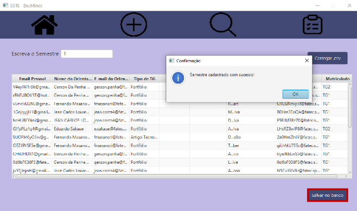

    - Header da aplicação para navagegação do aplicativo

        

    - Tela de visualização de atividades

        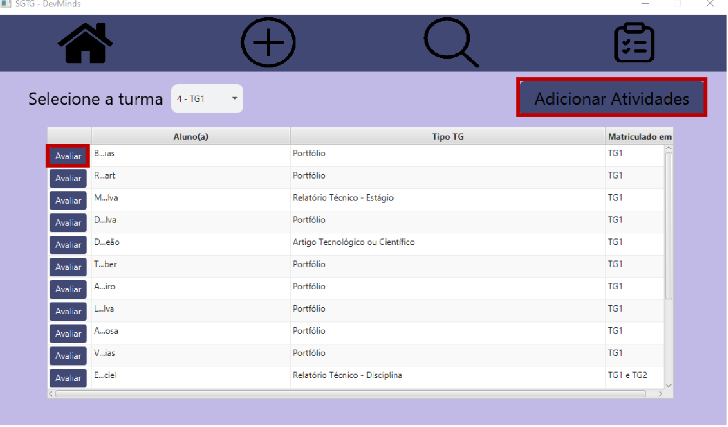

    - Tela de criação de atividades

        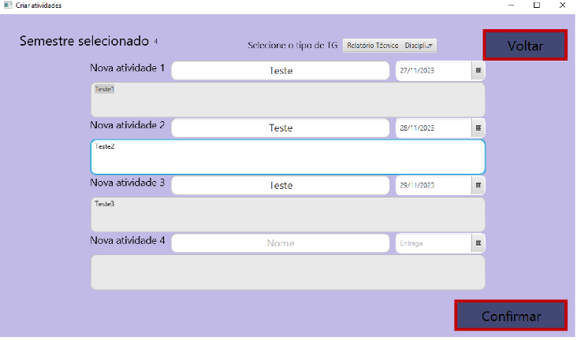

    - Tela de relatórios

        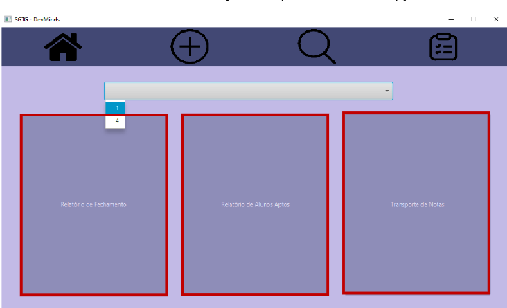

### 🔑 Hard Skills

- Java
- JavaFX
- MySQL

### 🤝 Soft Skills

**Trabalho em Equipe**

Colaboração efetiva com desenvolvedores para manter um bom fluxo do andamento das tarefas distribuidas entre nós.

**Gestão de Tempo e Priorização**

Balanceamento entre demandas de desenvolvimento, documentação e prazos acadêmicos, garantindo entregas iterativas dentro do cronograma.

### Pipeline Configurator - Configuração de Pipeline de Dados (2024-1)

**Projeto em parceria com Dom Rock (FATEC - 2024-1)**

O problema foi apresentado pela parceira **Dom Rock**, especialista em tratamento de dados. O desafio foi desenvolver uma aplicação para automatizar e configurar as etapas iniciais de uma **pipeline de tratamento de dados** (**Landing Zone**, **Bronze** e **Silver**).

A solução, o '**Pipeline Configurator**', foi entregue pela equipe **Void**. É uma **aplicação web full-stack** desenvolvida com Front-end **Vue.js**, servidor **Java Spring Boot** e banco de dados **MySQL**.

#### Funcionalidades
* **🛬 Landing Zone**: Entrada de arquivos CSV para ingestão inicial.
* **🥉 Bronze**: Definição de **ID único**, seleção de colunas para geração de **hash** e exclusão de dados.
* **🥈 Silver**: Aplicação de **regras de negócio** e criação de **relacionamentos 'De/Para'**.

#### Tecnologias Utilizadas
* **Back-end**: **Java**, **Spring Boot** (APIs REST, CRUD), **MySQL**.
* **Front-end**: **Vue.js**, **TypeScript**.
* **Git/GitHub**.

### 🌟 Contribuições Pessoais

💻 Backend (Java/Spring Boot) e Arquitetura

*Desenvolvimento em Java/Spring Boot*

* **APIs REST:** Implementação dos *endpoints* em **Spring Boot** para o **CRUD** das configurações de Bronze e Silver.
* **Modelagem MySQL:** Criação das estruturas de banco de dados para persistir definições de *hash* e as regras 'De/Para'.
* **Ingestão de Dados:** Lógica da **Landing Zone** para o processamento e validação inicial dos arquivos CSV.

🌐 Frontend e Interação (UX)

*Desenvolvimento em Vue.js e TypeScript*

* **Interface Reativa:** Construção de componentes **Vue.js** para a interface do configurador, focando na usabilidade para a definição de regras complexas.

* **Interface Reativa**: Construção de componentes **Vue.js** para a interface do configurador.
* **Testes**: Realização de **testes unitários** no backend.

### 🔑 Hard Skills
* **Java** e **Spring Boot**: Autonomia (Security, JWT, mapeamento de entidades, serviços e *controllers*).
* **SQL**: Autonomia (DDL e DQL).
* **Vue.js** e **TypeScript**.

### 🤝 Soft Skills
* **Trabalho em Equipe e Colaboração Interfuncional**: Como membro da equipe, colaborei ativamente com desenvolvedores front-end e back-end para garantir a integração perfeita entre os serviços e a interface.
* **Solução de Problemas Complexos (Pipeline de Dados)**: Apliquei raciocínio lógico e analítico para desenhar a arquitetura da pipeline (Landing Zone, Bronze, Silver) e traduzir as complexas regras de negócio da Dom Rock (hash, exclusão, De/Para) em estruturas de dados e APIs REST funcionais.
* **Comunicação Técnica e Não-Técnica**: Mantive uma comunicação clara sobre o progresso e os desafios técnicos (APIs, persistência de dados) tanto dentro da equipe quanto com a parceira Dom Rock, garantindo o alinhamento das entregas com os requisitos do projeto.

***

### Geo IoT - Sistema de Geolocalização (2024-2)

**Projeto Acadêmico FATEC (FATEC - 2º Semestre 2024)**

O desafio foi proposto pela parceira **Ito1**, especializada em tecnologias IoT. O objetivo era desenvolver uma ferramenta que consumisse dados de **geolocalização** de dispositivos IoT e os exibisse em um mapa interativo para monitoramento.

A equipe **Manolito** propôs e entregou o '**Geo IoT**', uma **aplicação web full-stack** com Front-end **Vue.js**, servidor **Java Spring Boot** e banco de dados **Oracle Cloud**.

#### Funcionalidades
* **Plotagem dos dados** de geolocalização em um mapa.
* **Filtros** de dispositivos por tipo, localização e período.
* **Geofencing**: Criação de áreas de interesse para alertas.
* **Controle de Acesso** por níveis de usuário.

#### Tecnologias Utilizadas
* **Back-end**: **Java**, **Spring Boot**, **Oracle Cloud** (**Oracle Database/Spatial**), **Redis**, **Docker**.
* **Front-end**: **Vue.js**, **TypeScript**, **OpenLayers**.
* **Git/GitHub**.

### 🌟 Contribuições Pessoais

🌐 Telas e Experiência do Usuário (UX)

- Implementação de:
    - Componente de filtragem por colaborador

        - Design antigo

            -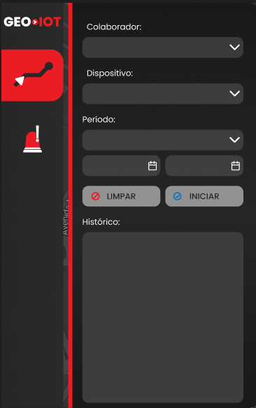

        - Design atual

            -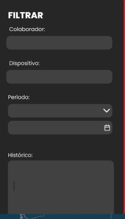

     - Juntamente com sua lógica e UX

        - Preenchimento automático de campos para acelerar a usabilidade do sistema
        - Auto-complete de nomes
    - Componente de criação de zona de interesse

        - Design antigo

            - 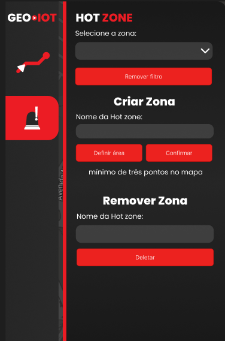

        - Design atual

            -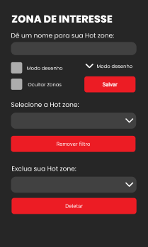

     - Juntamento com sua lógica e UX

    - Icones e suas animações

        - Design antigo

            - 

        - Design atual

            -

### 🔑 Hard Skills
* **Java** e **Spring Boot**
* **Oracle Cloud**
* **CI** e **Git/GitHub**.
* **Vue** e **TypeScript**.

### 🤝 Soft Skills

**Comunicação**: Comunicação sobre andamento de tarefas tanto com o SM quanto com os desenvolvedores para manter todos alinhados.

**Adaptabilidade**: Ajuste contínuo a mudanças de escopo e feedback dos usuários durante o ciclo de desenvolvimento ágil.

***

### Youtan Dash - Dashboard de Indicadores de Projetos (2025-1)

**Projeto em parceria com Youtan (FATEC - 2025-1)**

O desafio proposto pela empresa **Youtan** consistiu em desenvolver uma aplicação para uso interno que se integra a ferramentas de gestão de projeto (Taiga, Jira, Trello). O objetivo é gerar e visualizar **indicadores sobre o andamento dos projetos**.

A solução, o '**Youtan Dash**', é uma **aplicação web full-stack** com Front-end em **Vue.js**, servidor **Java Spring Boot** com serviços **Apache Spark** e banco de dados **PostgreSQL**.

## Funcionalidades
* **Integração com APIs** das ferramentas Taiga, Jira e Trello.
* **Dashboards com métricas** de produtividade (Tasks/Cards criados/completados, tempo médio de finalização, retrabalhos).
* **Controle de acesso** por níveis de usuário.
* **Exportação de dados** de Dashboards para `.csv`.

## Tecnologias Utilizadas
* **Back-end**: **Java**, **Spring Boot**, **Spring Security**, **PostgreSQL**, **Apache Spark** (para ETL), **Flyway**, **JWT**, **JUnit**.
* **Front-end**: **Vue.js**, **TypeScript**, **PrimeVue**, **Axios**.
* **DevOps**: **GitHub Actions** (CI/CD), **SonarCloud**.

### 🌟 Contribuições Pessoais

💡 ETL, Data Analytics e Integração de Dados

*Desenvolvimento do Back-end de Integração e Processamento*

* **Integração e ETL com Apache Spark**: Fui responsável pela engenharia de dados (Extração, Transformação e Carga). Desenvolvi os serviços em **Java** e **Spring Boot** que utilizam o **Apache Spark** para extrair dados das APIs REST do Taiga, Jira e Trello, realizar o tratamento (limpeza, normalização) e carregar no Data Warehouse.
    * **Integrações Suportadas**:

        * **Jira**: 

        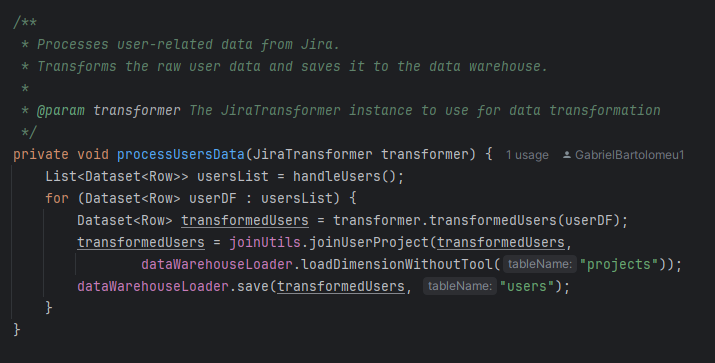

        * **Taiga**:
        
         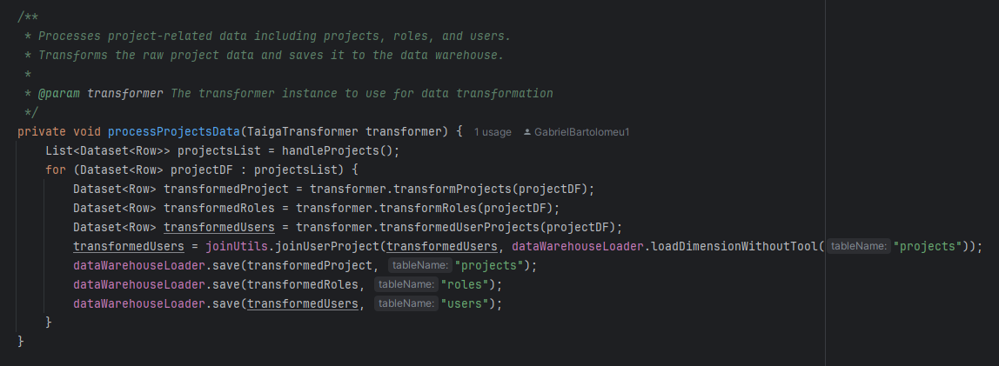

        * **Trello**:

        
         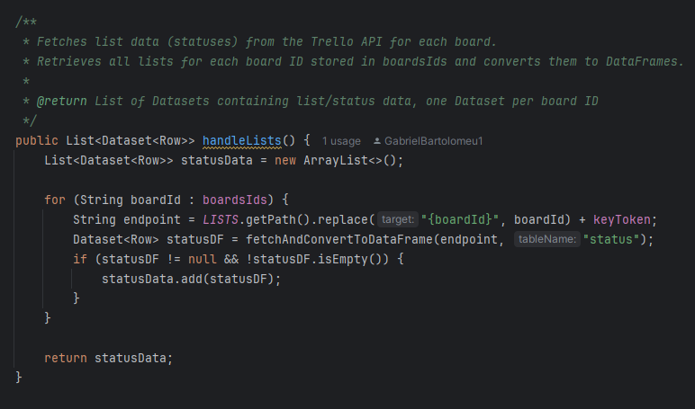

* **Modelagem do Data Warehouse (DW)**: Trabalhei na reestruturação e otimização do esquema de banco de dados **PostgreSQL** (com migrações via **Flyway**) para garantir a performance e a integridade necessárias para o armazenamento de dados analíticos provenientes do ETL.
* **APIs de Dados**: Criei *endpoints* específicos em **Spring Boot** para fornecer ao Front-end (Vue.js) os dados já processados e agregados, que alimentam os dashboards e métricas.
* **Histórico de Contribuições**: [Link para o Histórico de Pull Requests](https://github.com/manolito-fatec/web-server-2025-1/pulls?q=is%3Apr+is%3Aclosed+author%3AGabrielBartolomeu1)

⚙️ DevOps e Qualidade de Processo

* **Rastreabilidade de Requisitos**: Implementei práticas de DevOps e documentação para garantir a rastreabilidade completa entre os requisitos de negócio definidos pela Youtan e as tarefas de desenvolvimento, assegurando que cada funcionalidade fosse validada e entregue conforme a especificação.
* **Portal de Rastreabilidade**: [Acesse o Site de Rastreabilidade de Requisitos](https://youtan-req.vercel.app/#Introduction)
* **Testes Automatizados**: Contribuição na escrita de testes unitários (**JUnit**) para garantir a robustez e a confiabilidade dos serviços de ETL e das APIs de processamento de dados.

### 🔑 Hard Skills
* **Java** e **Spring Boot**
* **Apache Spark**
* **PostgreSQL**
* **Vue.js** e **TypeScript**

### 🤝 Soft Skills
* **Visão Sistêmica e Arquitetura**: Habilidade para desenhar e integrar um fluxo de dados complexo (APIs externas -> Spark ETL -> DW -> APIs Spring Boot) em uma arquitetura full-stack coesa.
* **Orientação a Resultados (Indicadores)**: Foco em traduzir requisitos de negócio (KPIs de projeto) em soluções técnicas de ETL e Dashboards, garantindo que o sistema entregue valor imediato à empresa parceira (Youtan).
* **Organização e Qualidade de Processo**: Responsabilidade pela implementação da rastreabilidade de requisitos, assegurando a conformidade do produto final com as especificações iniciais e mantendo um ciclo de desenvolvimento (DevOps) transparente.

***

### Pardal - Gerenciamento Inteligente de Tickets e LGPD (2025-2)

**Projeto Final de Graduação (6º Semestre) em parceria com Pro4Tech**

O desafio do último semestre envolveu a modernização do sistema de suporte do cliente real **Pro4Tech**, que enfrentava dificuldades com o controle manual de tickets em uma base de dados legada, falta de histórico consolidado e ausência de indicadores de desempenho. Além disso, havia uma necessidade crítica de adequação à **Lei Geral de Proteção de Dados (LGPD)** no manuseio de informações sensíveis.

A equipe **Manolito** propôs e entregou a solução '**Pardal**', uma plataforma completa de gerenciamento de chamados que centraliza o atendimento, aplica inteligência artificial para *insights* preditivos e garante a anonimização automática de dados sensíveis.

A arquitetura envolveu um front-end em **Vue.js**, back-end em **Java Spring Boot** integrado a scripts **Python** para ETL e IA, utilizando bancos de dados **PostgreSQL** e **MongoDB**.

## Funcionalidades
* **Modernização LGPD**: Identificação e anonimização automática de dados sensíveis em campos de texto livre utilizando Regex e NLP (Processamento de Linguagem Natural).
* **Insights Preditivos**: Utilização de IA para prever riscos de estouro de SLA (Service Level Agreement) e classificar tickets.
* **Dashboards Gerenciais**: Visualização de KPIs como tempo médio de resolução, volume de tickets e taxa de recorrência.
* **Busca Avançada**: Sistema de filtragem dinâmica por múltiplos critérios (status, categoria, agente, prioridade).
* **Relatórios Personalizados**: Exportação de dados e gráficos dos dashboards em formatos PDF e CSV.

## Tecnologias Utilizadas

* **Back-end**: **Java**, **Spring Boot**, **Spring Security** (+JWT), **JPA/Hibernate**, **PostgreSQL**, **MongoDB**, **Python**, **Vault**, **Swagger**.
* **Front-end**: **Vue.js**, **TypeScript**, **PrimeVue**, **Axios**.
* **DevOps/Outros**: **Docker**, **IntelliJ IDEA**, **VS Code**, **Figma**.

### 🌟 Contribuições Pessoais

📈 Backend e Análise de Dados (Java/Spring Boot)

* **APIs Analíticas de Desempenho (KPIs):** Desenvolvi e implementei os endpoints em **Java/Spring Boot** responsáveis por calcular e expor métricas gerenciais chave, essenciais para os Dashboards:

    * Criação do **Endpoint de Tempo Médio de Resolução**.
    

        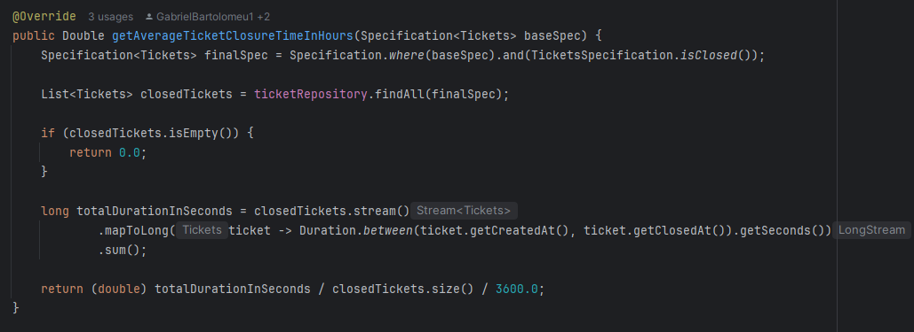

    * Implementação do **Serviço `getCount` de Subcategorias**, fornecendo a base de dados para a regra de Pareto e volume de tickets.
    

        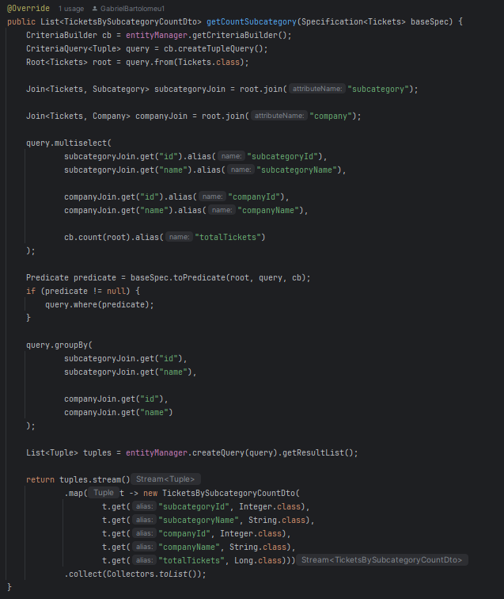

🌐 Front-end e User Experience (Vue.js/TypeScript)

* **Dashboards de Insights (Pareto):** Desenvolvi o componente **Gráfico de Pareto** em **Vue.js/PrimeVue**, traduzindo os dados de subcategorias em visualizações focadas nas prioridades de resolução (Regra 80/20).
    
        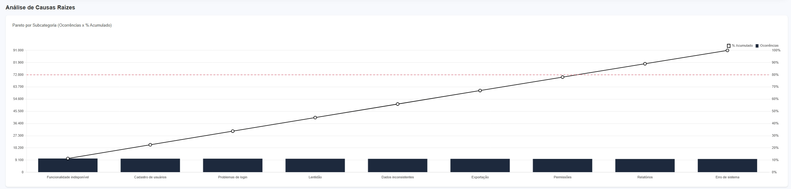
* **Busca Avançada e Filtragem:** Implementei as funcionalidades de filtros dinâmicos no sistema, melhorando a capacidade do usuário de segmentar tickets e encontrar informações rapidamente:
    * Implementação e melhoria do **Filtro de Busca por Cliente**.
    * Implementação do **Filtro de Busca por Produto**.
    
        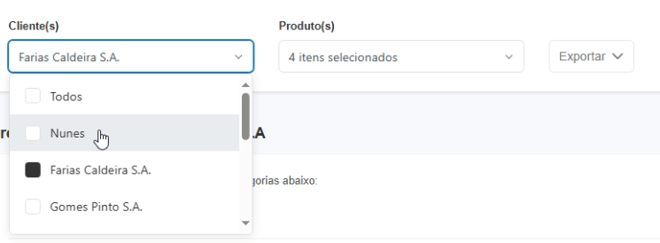
* **Integração Preditiva:** Construí o componente de **Previsão de Tickets Estourarem**, garantindo a exibição clara e reativa dos alertas de risco de SLA calculados pelo backend.

### 🔑 Hard Skills
* **Java** e **Spring Boot** * **JPA Specification** e **Criteria Builder**
* **Vue.js** e **TypeScript**

### 🤝 Soft Skills
* **Visão de Produto:** Foco na tradução de necessidades de negócio (monitoramento de SLA e volume de chamados) em *endpoints* de dados concretos e componentes de visualização (**Gráfico de Pareto**), garantindo que o produto entregue valor gerencial.
* **Solução de Problemas em Arquiteturas Híbridas:** Habilidade em integrar e orquestrar serviços de backend (**Java/Spring Boot**) com diferentes tecnologias de persistência (**PostgreSQL**)
* **Orientação à Qualidade:** Garantia da qualidade dos dados expostos pelos endpoints para Dashboards e foco na experiência do usuário ao desenvolver filtros de busca rápidos e intuitivos.